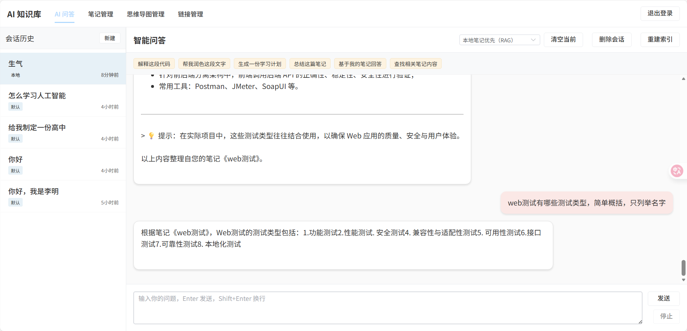
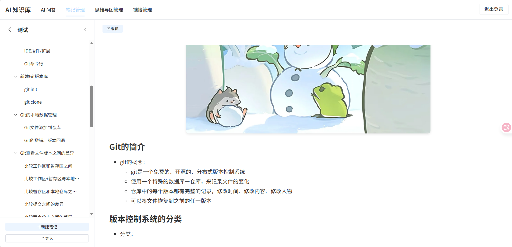
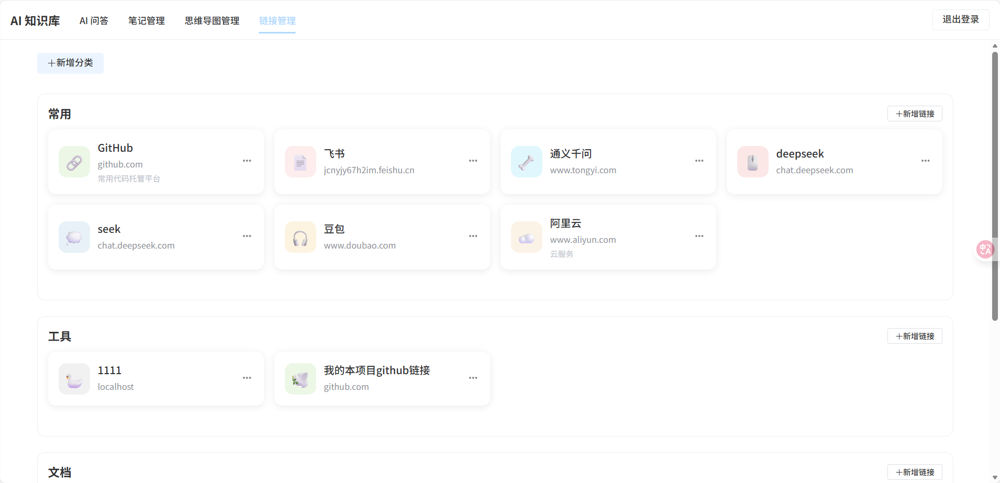
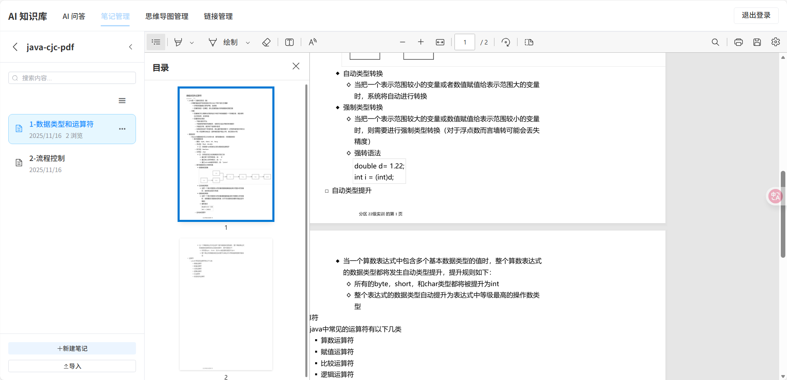
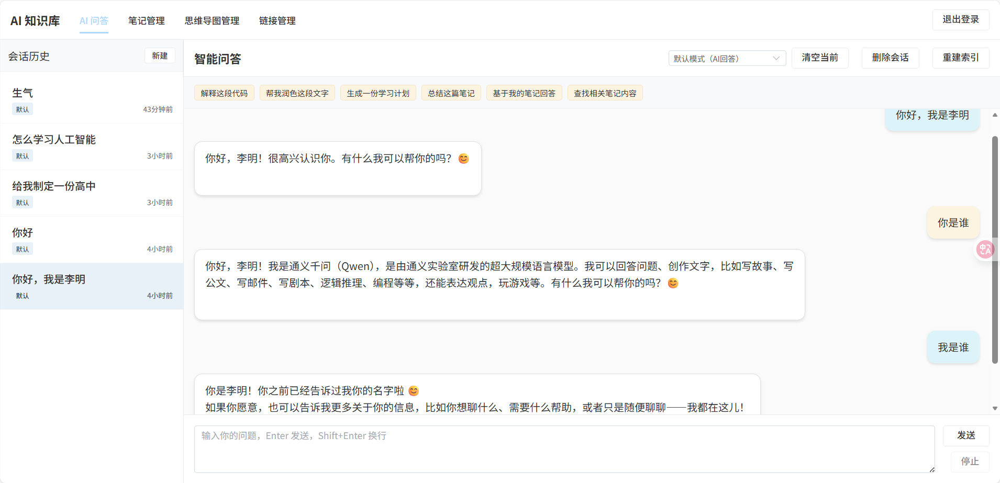
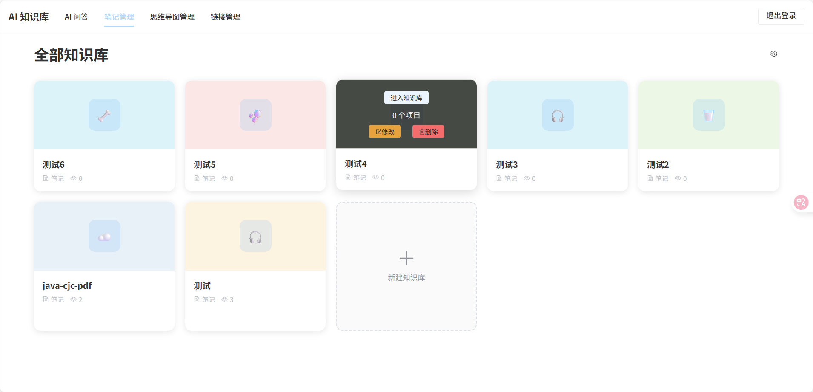
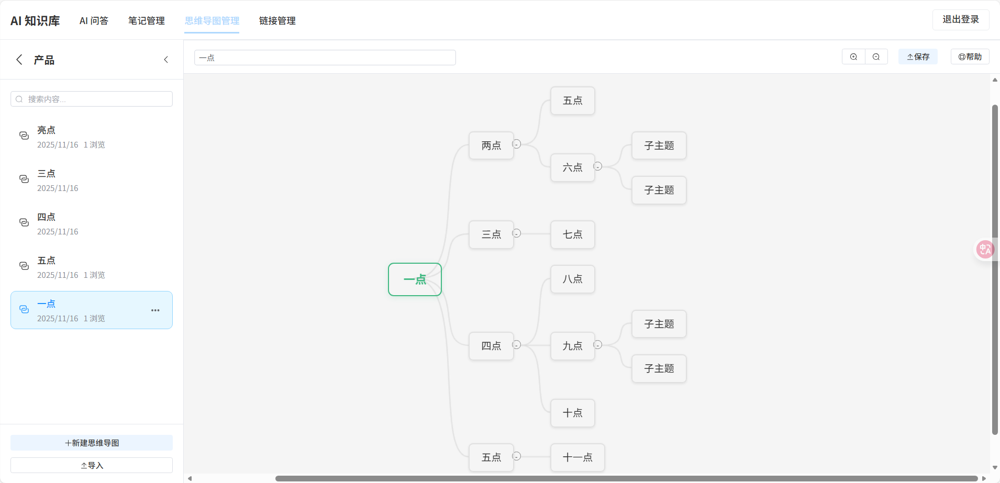

# AI 知识库管理系统


一个基于 Spring Boot + Vue 3 的智能知识库管理系统，集成 AI 对话、笔记管理、思维导图、文件管理等功能。

---


- 前端：[K-iitty/AIKnowledgeBaseFrontend: 智能问答知识库](https://github.com/K-iitty/AIKnowledgeBaseFrontend)
- 后端：[K-iitty/AIKnowledgeBaseBackend: 智能问答知识库](https://github.com/K-iitty/AIKnowledgeBaseBackend)

##  功能特性

### AI 智能助手

- **智能对话**：集成阿里云通义千问大模型
- **RAG 检索增强**：基于本地知识库的智能问答
- **会话管理**：多会话支持，历史记录保存
- **文本润色**：AI 辅助优化笔记内容
- **智能摘要**：自动生成内容摘要
- **上下文记忆**：支持多轮对话上下文

### 笔记管理

- **Markdown 编辑器**：支持实时预览、语法高亮
- **分类管理**：树形分类结构，支持拖拽排序
- **标签系统**：多标签支持，快速筛选
- **文件导入**：支持 Markdown、PDF 等格式导入
- **导出功能**：支持导出为 Markdown 或 PDF
- **封面设置**：自定义笔记封面图片

### 思维导图

- **可视化编辑**：基于 jsMind 的交互式思维导图编辑器
- **节点管理**：支持添加、编辑、删除节点
- **节点备注**：为每个节点添加详细备注
- **导入导出**：支持 XMind 格式导入导出

### 链接收藏

- **网址管理**：收藏常用网站链接
- **分类整理**：按类别组织链接
- **图标显示**：自动获取网站图标
- **快速访问**：一键跳转到收藏网站

### 用户系统

- **用户注册/登录**：JWT Token 认证
- **权限管理**：基于 Spring Security 的权限控制
- **个人中心**：用户信息管理
- **数据隔离**：用户数据完全隔离

## 技术栈

### 后端技术

| 技术              | 版本    | 说明         |
| ----------------- | ------- | ------------ |
| Spring Boot       | 3.5.7   | 核心框架     |
| Spring Security   | 6.x     | 安全框架     |
| MyBatis Plus      | 3.5.5   | ORM 框架     |
| MySQL             | 8.0+    | 关系型数据库 |
| Redis             | 7.x     | 缓存数据库   |
| JWT               | 0.11.5  | Token 认证   |
| Spring AI Alibaba | 1.0.0.2 | AI 集成框架  |
| 阿里云 OSS        | 3.17.4  | 对象存储     |
| PDFBox            | 2.0.30  | PDF 处理     |
| Knife4j           | 4.4.0   | API 文档     |
| Lombok            | 1.18.32 | 代码简化     |

### 前端技术

| 技术         | 版本   | 说明          |
| ------------ | ------ | ------------- |
| Vue          | 3.5.6  | 前端框架      |
| Vue Router   | 4.4.5  | 路由管理      |
| Element Plus | 2.8.6  | UI 组件库     |
| Axios        | 1.7.7  | HTTP 客户端   |
| Marked       | 17.0.0 | Markdown 解析 |
| jsMind       | 0.8.5  | 思维导图库    |
| Vite         | 5.4.10 | 构建工具      |

## 快速开始

### 环境要求

- **JDK**: 17+
- **Node.js**: 16+
- **MySQL**: 8.0+
- **Redis**: 7.x+
- **Maven**: 3.6+

### 后端启动

1. **克隆项目**

```bash
git clone <repository-url>
cd xian-AIKnowledgeBase/AIKnowledgeBaseBackend/AIKnowledgeBaseBackend
```

2. **配置数据库**

创建数据库：

```sql
CREATE DATABASE aiknowledgebase CHARACTER SET utf8mb4 COLLATE utf8mb4_unicode_ci;
```

3. **修改配置文件**

编辑 `src/main/resources/application.yml`：

```yaml
spring:
  datasource:
    url: jdbc:mysql://localhost:3306/aiknowledgebase?useUnicode=true&characterEncoding=UTF-8&serverTimezone=Asia/Shanghai
    username: your_username
    password: your_password
  
  data:
    redis:
      host: localhost
      port: 6379
      password: your_redis_password
  
  ai:
    dashscope:
      api-key: your_dashscope_api_key  # 阿里云通义千问 API Key

aliyun:
  oss:
    endpoint: oss-cn-beijing.aliyuncs.com
    bucket-name: your_bucket_name
    access-key-id: ${OSS_ACCESS_KEY_ID}
    access-key-secret: ${OSS_ACCESS_KEY_SECRET}

jwt:
  secret: your_jwt_secret_key_at_least_256_bits_long
  expiration: 604800000  # 7天
```

4. **设置环境变量**

```bash
# Windows
set OSS_ACCESS_KEY_ID=your_access_key_id
set OSS_ACCESS_KEY_SECRET=your_access_key_secret

# Linux/Mac
export OSS_ACCESS_KEY_ID=your_access_key_id
export OSS_ACCESS_KEY_SECRET=your_access_key_secret
```

5. **启动后端**

```bash
# 使用 Maven
mvn clean install
mvn spring-boot:run

# 或使用 IDE 直接运行 AiKnowledgeBaseBackendApplication
```

后端服务将在 `http://localhost:8081` 启动

### 前端启动

1. **进入前端目录**

```bash
cd xian-AIKnowledgeBase/AIKnowledgeBaseFrontend
```

2. **安装依赖**

```bash
npm install
```

3. **启动开发服务器**

```bash
npm run dev
```

前端服务将在 `http://localhost:5173` 启动

4. **构建生产版本**

```bash
npm run build
```

## 页面
















##  项目结构

### 后端结构

```
AIKnowledgeBaseBackend/
├── src/main/java/com/fanfan/aiknowledgebasebackend/
│   ├── config/              # 配置类
│   │   ├── CorsConfig.java           # 跨域配置
│   │   ├── JwtAuthenticationFilter.java  # JWT 过滤器
│   │   ├── OssConfig.java            # OSS 配置
│   │   └── SecurityConfig.java       # 安全配置
│   │
│   ├── controller/          # 控制器层
│   │   ├── AiController.java         # AI 对话接口
│   │   ├── AuthController.java       # 认证接口
│   │   ├── CategoryController.java   # 分类管理
│   │   ├── FileController.java       # 文件管理
│   │   ├── LinkController.java       # 链接管理
│   │   ├── MindmapController.java    # 思维导图
│   │   ├── NoteController.java       # 笔记管理
│   │   └── ProfileController.java    # 个人资料
│   │
│   ├── dto/                 # 数据传输对象
│   │   ├── ChatRequest.java
│   │   ├── LoginRequest.java
│   │   ├── RegisterRequest.java
│   │   ├── NoteRequest.java
│   │   ├── MindmapCreateRequest.java
│   │   └── ...
│   │
│   ├── entity/              # 实体类
│   │   ├── User.java
│   │   ├── Note.java
│   │   ├── Mindmap.java
│   │   ├── ChatSession.java
│   │   ├── ChatMessage.java
│   │   └── ...
│   │
│   ├── mapper/              # MyBatis Mapper
│   │   ├── UserMapper.java
│   │   ├── NoteMapper.java
│   │   ├── MindmapMapper.java
│   │   └── ...
│   │
│   ├── service/             # 业务逻辑层
│   │   ├── impl/
│   │   ├── UserService.java
│   │   ├── NoteService.java
│   │   ├── MindmapService.java
│   │   ├── EnhancedAiService.java    # AI 增强服务
│   │   └── RagService.java           # RAG 检索服务
│   │
│   └── util/                # 工具类
│       ├── JwtUtil.java
│       └── OssUtil.java
│
└── src/main/resources/
    ── application.yml      # 配置文件
```

### 前端结构

```
AIKnowledgeBaseFrontend/
├── src/
│   ├── assets/              # 静态资源
│   │   └── styles/          # 样式文件
│   │
│   ├── components/          # 组件
│   │   ├── MarkdownEditor.vue    # Markdown 编辑器
│   │   ├── MindMapEditor.vue     # 思维导图编辑器
│   │   ├── ChatWindow.vue        # AI 聊天窗口
│   │   └── ...
│   │
│   ├── layouts/             # 布局组件
│   │   └── MainLayout.vue        # 主布局
│   │
│   ├── router/              # 路由配置
│   │   └── index.js
│   │
│   ├── utils/               # 工具函数
│   │   └── http.js              # HTTP 请求封装
│   │
│   ├── views/               # 页面组件
│   │   ├── Login.vue            # 登录页
│   │   ├── Register.vue         # 注册页
│   │   ├── Notes.vue            # 笔记列表
│   │   ├── NoteDetail.vue       # 笔记详情
│   │   ├── Mindmaps.vue         # 思维导图列表
│   │   ├── MindmapDetail.vue    # 思维导图详情
│   │   ├── AIChat.vue           # AI 对话
│   │   ├── Links.vue            # 链接收藏
│   │   ├── Profile.vue          # 个人资料
│   │   └── KnowledgeContent.vue # 知识库内容
│   │
│   ├── App.vue              # 根组件
│   └── main.js              # 入口文件
│
├── index.html               # HTML 模板
├── package.json             # 依赖配置
└── vite.config.js           # Vite 配置
```

---

## API 文档

### 访问 Swagger UI

启动后端后，访问：

- Swagger UI: `http://localhost:8081/swagger-ui.html`
- Knife4j UI: `http://localhost:8081/doc.html`

### 1. RAG 检索增强生成

系统实现了基于本地知识库的 RAG（Retrieval-Augmented Generation）功能：

- **索引构建**：自动为笔记和思维导图建立关键词索引
- **语义检索**：支持中英文混合检索，智能匹配相关内容
- **上下文增强**：将检索到的知识库内容作为上下文提供给 AI
- **相关性排序**：基于 TF-IDF 和关键词匹配的相关性评分

### 2. 思维导图编辑器

基于 jsMind 实现的功能丰富的思维导图编辑器：

- **节点操作**：添加、编辑、删除子节点和同级节点
- **节点备注**：为每个节点添加详细的文字备注
- **图片附件**：支持为节点添加图片资源
- **样式自定义**：支持节点颜色、字体等样式设置
- **导入导出**：支持 XMind 格式的导入导出

### 3. Markdown 编辑器

功能完善的 Markdown 编辑器：

- **实时预览**：编辑和预览同步显示
- **语法高亮**：代码块语法高亮显示
- **工具栏**：常用 Markdown 语法快捷插入
- **图片上传**：支持拖拽上传图片到 OSS
- **全屏编辑**：支持全屏编辑模式

### 4. AI 对话系统

集成阿里云通义千问的智能对话系统：

- **流式响应**：支持 SSE 流式输出
- **上下文记忆**：保存对话历史，支持多轮对话
- **知识库增强**：可选择基于本地知识库的问答
- **会话管理**：支持创建、切换、删除会话

---

##  配置说明

### 必需配置

1. **数据库配置**
   - MySQL 8.0+ 数据库
   - 创建数据库 `aiknowledgebase`
   - 配置用户名和密码

2. **Redis 配置**
   - Redis 7.x+ 服务
   - 配置连接信息

3. **阿里云通义千问 API**
   - 注册阿里云账号
   - 开通通义千问服务
   - 获取 API Key

4. **阿里云 OSS**
   - 创建 OSS Bucket
   - 获取 AccessKey ID 和 Secret
   - 配置 Bucket 名称和 Endpoint

5. **JWT Secret**
   - 生成至少 256 位的密钥
   - 配置在 `application.yml` 中

### 可选配置

- **文件上传大小限制**：默认 10MB
- **Token 过期时间**：默认 7 天
- **AI 模型参数**：temperature、model 等

## 开发规范

### 代码规范

- **后端**：遵循阿里巴巴 Java 开发规范
- **前端**：遵循 Vue 3 官方风格指南
- **命名**：使用有意义的变量名和函数名
- **注释**：关键逻辑添加注释说明

## License

本项目采用 MIT 许可证。详见 [LICENSE](LICENSE) 文件。

##  贡献

欢迎提交 Issue 和 Pull Request！

##  联系方式

如有问题或建议，请通过以下方式联系：

- 提交 Issue

**⭐ 如果这个项目对你有帮助，请给一个 Star！⭐**

